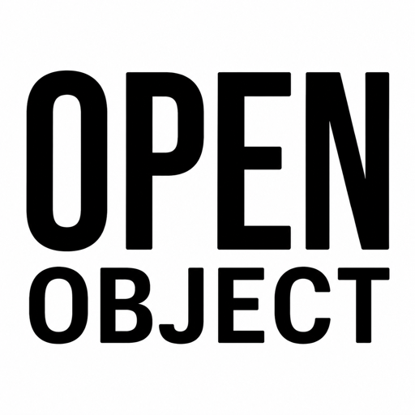

<p align="center">
  
</p>

# OpenObject

A clean, local art player you fully control. Run your own images and video full screen on a Mac
with an everyday monitor, or use it to revive a stranded **Infinite Objects XXL**, the 26-inch
square art frame whose original solution decayed. OpenObject runs from a web page in any browser,
depends on no outside service, and nothing expires. No cloud, no accounts, no subscription.

**Website:** [openobject.io](https://openobject.io)

> **Status: working today.** Set it up on a Mac in a few minutes, or revive a real frame. The web
> app (control panel and display) and a Debian-based installer are built and verified on an actual
> XXL, which boots with no desktop straight into the art at `http://openobject.local`. The source
> is public, but all rights are reserved (see [License](#license)).

## Why

The Infinite Objects XXL is a normal x86 mini PC (a MeLE Quieter 3Q) behind a square panel, not a sealed
appliance. The original solution decayed over time and left good hardware stuck. Full credit
to the White Walls app that powered it, the real hero of the whole setup. OpenObject is a
software reflash that brings the hardware back under your control, with two commitments:

1. **Self-contained on the player.** The mini PC is the always-on brain. You upload artwork
   and control the frame's settings from a browser on your phone or any other device, and the
   frame keeps running on its own, with or without it.
2. **Revivable by the next owner.** This is meant as a shareable kit, so anyone with a stranded
   XXL can follow along and bring their own unit back.

## What it does

- Displays **JPEG, PNG, GIF, AVIF, WebP, SVG, MP4, MOV, WebM**, edge to edge on the square panel,
  with no frame and no border.
- **Library, Rotation, and Pin.** Everything you upload is kept. You choose what plays and in
  what order (**Sequence** or **Shuffle**), and you can pin one piece to hold it permanently.
- **Per-clip control.** One global hold duration, plus **Fit** (the whole image, the default)
  or **Fill** (crop to fill the square).
- **Animated art and video always loop** to fill their time and never freeze on the first
  frame. Silent by design.
- **Sleep Schedule** to blank the panel on a schedule, by time of day and day of week.
- Add art by **dragging files onto the control panel** from any device. No accounts, no cloud.
- **Connected Collections.** Beyond your own files, show a curated handful of generative and
  on-chain artworks, like a p5.js sketch that renders itself live in the frame rather than a saved
  image. Added by token ID and mirrored to the device, so they play offline too. Curated, not a
  general NFT reader.
- **Updates itself** from this repo (control panel, then *Check for updates*). No reflash.

## Hardware target

| | |
| --- | --- |
| Frame | Infinite Objects XXL (26-inch, 1:1 square, 1920x1920) |
| Player | MeLE Quieter 3Q, Intel Celeron N5105 (x86-64), Wi-Fi plus Gigabit Ethernet |
| Video path | Captive HDMI from the mini PC to the panel, untouched by the reflash |

This hardware is only for reviving an actual frame. **No frame? You do not need any of it.** See [Get started](#get-started) to run OpenObject on a Mac and an everyday monitor.

## Get started

Two ways in:

- **No frame? Use your Mac as the display.** The **[Mac display guide](docs/MAC-DISPLAY-SETUP.md)**
  turns your Mac and an everyday monitor into a full-screen art player, step by step in plain
  language.
- **Reviving an Infinite Objects XXL?** The **[Setup Guide](docs/SETUP-GUIDE.md)** walks the whole
  revival in plain language. Builders can use **[installer/](installer/README.md)**, the bench
  runbook (wipe the eMMC, install minimal Debian, run `install.sh`, boot into the kiosk).

## Repository layout

```
docs/        engineering spec (HANDOFF) plus the casual SETUP-GUIDE and appendixes
player/      the OpenObject web app (Node and SQLite, no build step)
installer/   the Debian and Chromium-kiosk installer for the frame
assets/      branding (the OpenObject mark)
site/        the openobject.io landing page (static HTML, served via GitHub Pages)
```

## Documentation

- **[Mac Display Guide](docs/MAC-DISPLAY-SETUP.md)**: run OpenObject on a Mac as the display, no frame needed.
- **[Setup Guide](docs/SETUP-GUIDE.md)**: for owners reviving a unit (no engineering).
- **[Handoff / Build Spec](docs/HANDOFF.md)**: the full engineering spec and decision log.
- **[Installer runbook](installer/README.md)**: how the frame is provisioned.
- **[Original software reset](docs/appendix-original-reset.md)**: returning the frame to the original
  software, for owners who want it back.

## License

**Proprietary. All rights reserved.** The source is public, but OpenObject is not open source, and
publishing it grants no license to reuse it. See the full [License](LICENSE).

In plain terms: you may download, install, run, and update OpenObject to power **your own** display
or frame, for personal noncommercial use. Without a separate written license from Queueue Studios
LLC you **may not** use it (or any of its source) in a commercial product, service, or venture,
redistribute or host it for others, or modify and distribute it. All other rights are reserved.

## No warranty

OpenObject is provided **as is**, with **no warranty of any kind**. To the fullest extent permitted
by law, Queueue Studios LLC is **not responsible** for what you do with OpenObject, for what it does
or fails to do, or for any resulting damage, data loss, or other harm, and makes **no guarantee**
that it works or will keep working.

**Running it on your own computer** (a Mac, for example) is low risk. It is just an app you start
and stop, kept in its own folder, and you can delete it whenever you like. It does not wipe or
alter the rest of your machine.

**Reviving an Infinite Objects frame is the part with real risk.** That path **wipes the frame's
storage**, with no supported way back. It may not work on your exact unit, it may stop working
after an update or over time, and in the worst case it could leave the frame unusable. You take
that risk yourself.

## Independence and trademarks

OpenObject is an independent project, written from scratch. It contains no source code, assets,
or data from the device's original manufacturer or any original software provider, and
incorporates none of it. Installing OpenObject erases the device's storage, removing all
original software and data before OpenObject is installed.

OpenObject is not affiliated with, authorized by, or endorsed by the device's original
manufacturer or any original software provider. Product and company names that appear elsewhere
in this project are the property of their respective owners and are used only to identify the
hardware and the original software OpenObject replaces.
