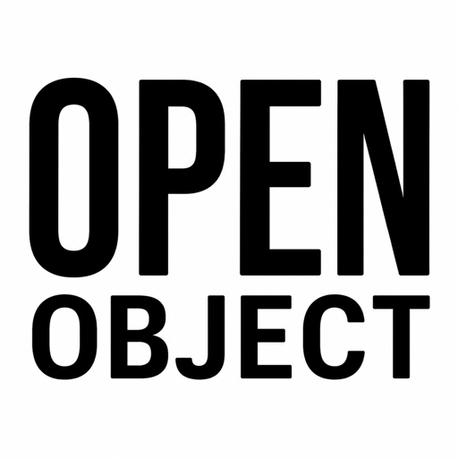

  

# OpenObject

OpenObject is a self-hosted platform for displaying digital art on your own screens. One lightweight
local core, multiple ways to display: your Mac, Apple TV, iPad, or a revived Infinite Objects XXL
frame ("Frame"). No cloud. No account. No subscription.

**[Download for Mac](https://github.com/queueue-studios/openobject/releases/latest)** · [openobject.io](https://openobject.io)

## The platform

| | Apple TV | iPad | Mac | Frame |
|---|:---:|:---:|:---:|:---:|
| **Displays your art** | ✓ | ✓ | ✓ | ✓ |
| **Hosts your art** | | | ✓ | ✓ |

*A Host can also function as a display.*

OpenObject is a lightweight local server that runs entirely on your own network. It has three jobs,
and different devices take on different tasks:

- **Host** holds your library and serves artwork to OpenObject displays on your network.
- **Control** is the web control panel you open in any browser to curate what plays.
- **Display** renders the art full screen, edge to edge, with no border and no chrome.

Some devices do all three on their own. Others are just a **Display** that connects to a Host on your
network.

| Device | Host | Control | Display | Status |
|---|:---:|:---:|:---:|---|
| **Mac** | ✓ | ✓ | ✓ | Available |
| **Infinite Objects XXL** frame | ✓ | ✓ | ✓ | Available (advanced) |
| **Apple TV** | - | - | ✓ | [Available on the App Store](https://apps.apple.com/app/id6797132025) |
| **iPad** | - | - | ✓ | Coming soon |

Your **Mac** and the **frame** are self-contained: each holds your art, is controlled from a browser,
and shows the art on its own. The **Apple TV** and **iPad** apps are displays that play from a Host
already running on your network.

## How it works

You upload your art, and OpenObject shows it edge to edge on a screen. Your everyday monitor, TV, or
frame becomes the art. Through the control panel, you manage your library, rotation, playback timing,
sleep schedule, and more from any browser on your network.

Under the hood it runs as a small local art player on a Host (your Mac or the frame), and presents the
art with no window, no menus, no toolbars, just art filling the screen. On a Mac it drives a Chromium
kiosk; the frame runs the same page as its own kiosk; the Apple TV and iPad apps render it natively.
Everything stays on your network.

OpenObject was designed to deliberately avoid wallet connections, blockchain APIs, and cloud services.
Instead, you keep local copies of the artwork you own and upload them directly. Everything stays on
your network. Simple, private, and resilient.

## What it does

- Add art by **dragging files onto the control panel** from any device.
- Displays **JPEG, PNG, GIF, AVIF, WebP, SVG, MP4, MOV, and WebM** artwork edge-to-edge with no
  borders or interface.
- **Library, Rotation, and Pin.** Everything you upload is kept. You choose what plays and in what
  order (Sequence or Shuffle), and can pin one piece to hold it permanently.
- **Fit or Fill.** One global hold duration, plus Fit (the whole image, the default) or Fill (crop
  to fill the screen).
- **Animated art and video always loop** and never freeze on the first frame.
- **Audio.** Enable or disable audio so a scored piece can optionally play sound on a supported device.
- **Sleep Schedule** to rest the screen by time of day and day of week.
- **Folder Collections.** Instead of uploading, point OpenObject at a folder on your computer and it
  shows everything inside. An easy way to display a large collection you already have on disk.
- **Connected Collections.** Certain curated generative and on-chain artworks (such as live p5.js
  pieces) are mirrored locally so they continue to render even without an internet connection. This is
  a curated feature, not a general-purpose NFT browser. Note: Connected Collections cannot be displayed
  with the Apple TV and iPad apps.
- **Built-in updates.** Install the latest release directly from within OpenObject.

## Requirements

- **Mac (Host):** a Mac (macOS 15 or later), a monitor to display on, and **Google Chrome** installed.
  OpenObject drives it in kiosk mode to render the art; you never see or use it as a browser.
- **Apple TV / iPad (Display):** the app, plus a Host (a Mac or a frame) running OpenObject on the same
  network. These apps show art from a Host; they do not host or curate on their own.

## Get started

**[Download OpenObject for Mac](https://github.com/queueue-studios/openobject/releases/latest)**, open
the `.dmg`, and drag OpenObject to Applications. The [Mac guide](docs/MAC-DISPLAY-SETUP.md) walks the
first run.

> ### Have an Infinite Objects XXL frame?
> OpenObject can revive one too. This is where OpenObject started: we built it to bring a stranded XXL
> back to life, and kept the code and a full guide so any owner can do the same. It is an advanced,
> hands-on path (a from-scratch install on the frame's mini PC), separate from the Mac app.
>
> → **[Reviving an Infinite Objects XXL](docs/SETUP-GUIDE.md)**

## On displaying art you love

Anyone can view digital art in a browser, download it, or screenshot it. That has always been true,
and it is not what OpenObject changes. Viewing art and displaying art you own are different things.
OpenObject is built to display art you own, or otherwise have the right to display, and it is intended
for home use. If you display art in public, please make sure you have a license to do so. We
deliberately avoided wallet connections and their complexity: the process is simply to save a local
copy of your art and upload it to OpenObject to display it.

## One core, many surfaces

The Mac app and an Infinite Objects XXL frame today, with Apple TV and iPad apps coming to the App
Store. Because the core is just a small local art player, it is not locked to any one device
(technically minded owners can even run it on their own hardware).

## Documentation

**On your Mac**
- [Mac guide](docs/MAC-DISPLAY-SETUP.md): install and first run.

**Reviving an Infinite Objects XXL frame** *(advanced)*
- [Reviving an XXL frame](docs/SETUP-GUIDE.md): the full walkthrough, in plain language.
- [Installer runbook](installer/README.md): bench provisioning (wipe, Debian, install).
- [Returning a frame to its original software](docs/appendix-original-reset.md): untested and
  unsupported, and only possible if you backed up first. At your own risk.

**Reference**
- [Handoff / Build Spec](docs/HANDOFF.md): the engineering spec and decision log.

## License

**Proprietary. All rights reserved.** The source is publicly available, but OpenObject is not open
source. Viewing the source does not grant permission to reuse, redistribute, or incorporate it into
another project. See the full [License](LICENSE).

In plain terms: you may download, install, run, and update OpenObject to power **your own** display
or frame, for personal noncommercial use. Without a separate written license from Queueue Studios
LLC you **may not** use it (or any of its source) in a commercial product, service, or venture,
redistribute or host it for others, or modify and distribute it. All other rights are reserved.

## No warranty

OpenObject is provided **as is**, with **no warranty of any kind**. To the fullest extent permitted
by law, Queueue Studios LLC is **not responsible** for what you do with OpenObject, for what it does
or fails to do, or for any resulting damage, data loss, or other harm, and makes **no guarantee**
that it works or will keep working.

**Running it on your own computer** (a Mac, for example) is simple. It is just an app you start
and stop, kept in its own folder, and you can delete it whenever you like. It does not wipe or
alter the rest of your machine.

**Reviving an Infinite Objects frame is the part with real risk.** That path **wipes the frame's
storage**, with no supported way back. It may not work on your exact unit, it may stop working
after an update or over time, and in the worst case it could leave the frame unusable. You take
that risk yourself.

## Independence and trademarks

OpenObject is an independent project, written from scratch. It contains no source code, assets,
or data from the device's original manufacturer or any original software provider, and
incorporates none of it. Installing OpenObject on a frame erases the frame's storage, removing all
original software and data before OpenObject is installed.

OpenObject is not affiliated with, authorized by, or endorsed by the device's original
manufacturer or any original software provider. All trademarks and product names belong to their
respective owners and are used solely to identify compatible hardware or software.
